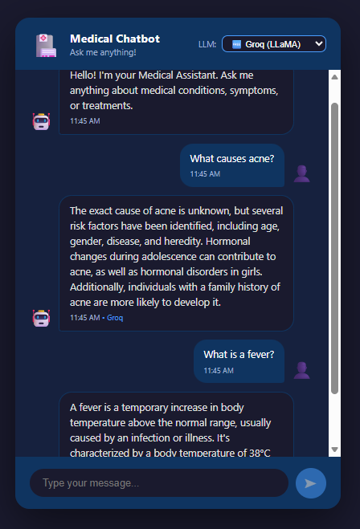

# 🏥 End-to-End-AI-Medical-Chatbot-with-LLMs-RAG-LangChain-Pinecone-FastAPI-React-Docker-Terraform-GitHub-CI-CD-AWS

## 📋 Overview
A production-ready RAG-based medical chatbot that answers medical questions using the Gale Encyclopedia of Medicine (637 pages). Users can switch between Groq (LLaMA 3.1) and OpenAI GPT-4o as the LLM provider.




## 🛠️ Tech Stack
- **Backend:** Python, FastAPI
- **Frontend:** React
- **LLM:** Groq (LLaMA 3.1) / OpenAI GPT-4o
- **Orchestration:** LangChain
- **Vector Database:** Pinecone
- **Embeddings:** HuggingFace sentence-transformers
- **Container:** Docker
- **Infrastructure:** Terraform
- **Cloud:** AWS EC2 + ECR
- **CI/CD:** GitHub Actions

---

## 🚀 How to Run Locally?

### STEPS:

**Clone the repository**
```
git clone https://github.com/Stevenmas-Ai/End-to-End-AI-Medical-Chatbot-with-LLMs-LangChain-Pinecone-Flask-AWS-.git
```

**STEP 01 - Create a conda environment**
```
conda create -n medicalbot python=3.11 -y
conda activate medicalbot
```

**STEP 02 - Install the requirements**
```
pip install -r requirements.txt
```

**STEP 03 - Create a `.env` file in the root directory**
```
PINECONE_API_KEY = "xxxxxxxxxxxxxxxxxxxxxxxxxxxxx"
OPENAI_API_KEY = "xxxxxxxxxxxxxxxxxxxxxxxxxxxxx"
GROQ_API_KEY = "xxxxxxxxxxxxxxxxxxxxxxxxxxxxx"
```

**STEP 04 - Store embeddings to Pinecone**
```
python store_index.py
```

**STEP 05 - Run the backend**
```
python -m uvicorn app:app --reload --port 8000
```

**STEP 06 - Run the frontend**
```
cd frontend
npm install
npm start
```

Now open:
```
http://localhost:3000
```

---

## ☁️ AWS CI/CD Deployment with Terraform & GitHub Actions

### 1. Login to AWS Console

### 2. Install Required Tools

**AWS CLI:**
```
https://awscli.amazonaws.com/AWSCLIV2.msi
```

**Terraform:**
```
https://developer.hashicorp.com/terraform/downloads
```

**Configure AWS CLI:**
```
aws configure
```

### 3. Generate SSH Key
```
ssh-keygen -t rsa -b 4096 -f ~/.ssh/medicalbot
```

### 4. Deploy Infrastructure with Terraform
```
cd terraform
terraform init
terraform plan
terraform apply
```

Terraform will automatically create:
```
1. IAM user with EC2 and ECR permissions
2. EC2 instance (Ubuntu, t2.large, 30GB storage)
3. ECR repository to store Docker image
4. Security groups (ports 22, 80, 8000)
5. SSH key pair
```

Save the outputs:
```
ec2_public_ip = "x.x.x.x"
ecr_repository_url = "xxxxxxxxxxxx.dkr.ecr.us-east-1.amazonaws.com/medical-chatbot"
```

### 5. Connect to EC2 and Install Docker
```
sudo apt-get update -y
sudo apt-get upgrade -y
curl -fsSL https://get.docker.com -o get-docker.sh
sudo sh get-docker.sh
sudo usermod -aG docker ubuntu
newgrp docker
docker --version
```

### 6. Configure EC2 as Self-Hosted Runner
```
settings > actions > runners > new self hosted runner > choose Linux > run commands one by one
```
When prompted:
- Runner group: press Enter
- Runner name: self-hosted
- Labels: press Enter
- Work folder: press Enter

Then start the runner:
```
./run.sh
```

### 7. Setup GitHub Secrets
Go to: **Settings → Secrets and variables → Actions → New repository secret**

| Secret | Value |
|--------|-------|
| `AWS_ACCESS_KEY_ID` | From IAM user |
| `AWS_SECRET_ACCESS_KEY` | From IAM user |
| `AWS_DEFAULT_REGION` | `us-east-1` |
| `ECR_REPO` | `medical-chatbot` |
| `PINECONE_API_KEY` | Your Pinecone key |
| `OPENAI_API_KEY` | Your OpenAI key |
| `GROQ_API_KEY` | Your Groq key |

### 8. Push Code to Trigger CI/CD
```
git add .
git commit -m "Deploy"
git push origin main
```

### 9. CI/CD Pipeline Flow
```
Push code to GitHub
        ↓
GitHub Actions triggers
        ↓
Build React frontend
        ↓
Build Docker image
        ↓
Push image to AWS ECR
        ↓
EC2 pulls image from ECR
        ↓
Docker container starts on EC2
        ↓
App live at EC2_IP:8000
```

### 10. Access the App
```
http://YOUR_EC2_IP:8000
```

---

## 📁 Project Structure
```
├── .github/
│   └── workflows/
│       └── cicd.yml          # GitHub Actions CI/CD pipeline
├── frontend/                  # React frontend
│   └── src/
│       ├── components/
│       │   ├── Chat.js        # Chat interface
│       │   └── Header.js      # Header with LLM selector
│       └── App.js             # Main React component
├── src/
│   ├── __init__.py
│   ├── helper.py              # PDF loading, chunking, embeddings
│   └── prompt.py              # LLM prompt template
├── terraform/
│   ├── main.tf                # AWS infrastructure
│   ├── variables.tf           # Terraform variables
│   └── outputs.tf             # Terraform outputs
├── research/
│   └── trials.ipynb           # Jupyter notebook experiments
├── data/
│   └── Medical_book.pdf       # Gale Encyclopedia of Medicine
├── app.py                     # FastAPI backend
├── store_index.py             # Store vectors in Pinecone
├── Dockerfile                 # Docker configuration
├── requirements.txt           # Python dependencies
└── .env                       # Environment variables (not committed)
```

---

## 🔑 API Endpoints

| Method | Endpoint | Description |
|--------|----------|-------------|
| GET | `/` | Serve React frontend |
| POST | `/chat` | Send message to chatbot |

### Chat Request
```json
{
  "message": "What is acne?",
  "provider": "groq"
}
```

### Chat Response
```json
{
  "answer": "Acne is a common skin disease...",
  "provider": "groq"
}
```

---

## 🗑️ Cleanup AWS Resources
To avoid charges, destroy resources when done:
```
cd terraform
terraform destroy
```

---

## 👨‍💻 Author
**Steven Gerard Mascarenhas**
- LinkedIn: [https://www.linkedin.com/in/steven-mas/]
- GitHub: [StevenGerardMascarenhas](https://github.com/StevenGerardMascarenhas)

## 📄 License
This project is licensed under the Apache License - see the LICENSE file for details.
